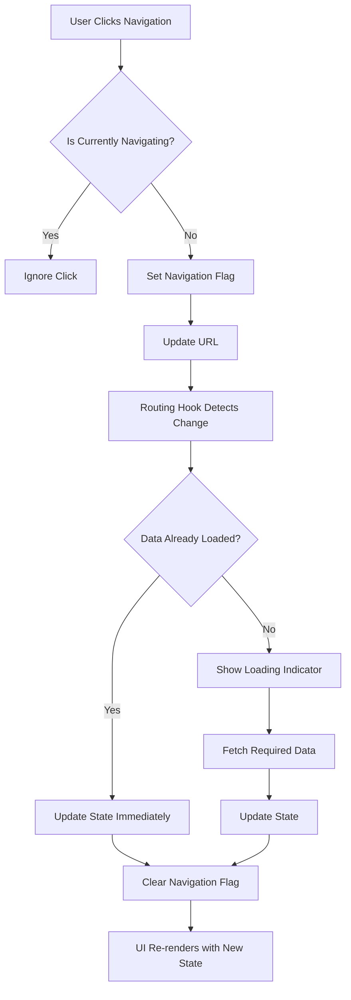

# 🚀 Navigation Optimization - Fixing Flickering & Navigation Issues

## Problems Identified & Fixed

### 1. **Circular Dependencies in useEffect Hooks**

**Problem**: Multiple useEffect hooks were triggering each other, causing infinite loops and flickering.

**Solution**:

- Added `isNavigatingRef` to track programmatic navigation
- Separated URL-to-state sync from state-to-URL sync
- Used `useCallback` for navigation functions to prevent unnecessary re-renders

### 2. **Missing Loading States**

**Problem**: UI was rendering incomplete data during navigation, causing visual flicker.

**Solution**:

- Added loading states: `isLoadingWorkspaces`, `isLoadingChannels`, `isLoadingDirectMessages`
- Implemented loading indicators in UI components
- Prevented multiple concurrent API requests

### 3. **Race Conditions**

**Problem**: Multiple state updates happening simultaneously during navigation.

**Solution**:

- Added request deduplication in fetch functions
- Implemented proper loading state management
- Used refs to track navigation state

### 4. **Unnecessary Re-renders**

**Problem**: Components re-rendering too frequently during navigation.

**Solution**:

- Optimized useEffect dependencies to use specific IDs instead of objects
- Added `disabled` states during navigation
- Implemented debounced navigation (optional)

## Key Optimizations Implemented

### 1. **Enhanced Routing Hook** (`use-routing.tsx`)

```typescript
// Prevents circular updates
const isNavigatingRef = useRef(false);

// Memoized navigation functions
const navigateToWorkspace = useCallback(
  (workspaceId: number) => {
    isNavigatingRef.current = true;
    navigate(`/workspace/${workspaceId}`);
    setTimeout(() => {
      isNavigatingRef.current = false;
    }, 100);
  },
  [navigate]
);

// Optimized effect dependencies
useEffect(() => {
  if (isNavigatingRef.current) return;
  // ... navigation logic
}, [
  location,
  params,
  workspaces,
  channels,
  directMessages,
  activeWorkspace?.id, // Use ID instead of object
  activeChannel?.id, // Use ID instead of object
  activeDM?.id, // Use ID instead of object
  // ... other dependencies
]);
```

### 2. **Loading State Management** (`ChatContext.tsx`)

```typescript
// Added loading states
const [isLoadingWorkspaces, setIsLoadingWorkspaces] = useState(false);
const [isLoadingChannels, setIsLoadingChannels] = useState(false);
const [isLoadingDirectMessages, setIsLoadingDirectMessages] = useState(false);

// Request deduplication
const fetchWorkspaces = async () => {
  if (isLoadingWorkspaces) return; // Prevent concurrent requests

  setIsLoadingWorkspaces(true);
  try {
    // ... fetch logic
  } finally {
    setIsLoadingWorkspaces(false);
  }
};
```

### 3. **UI Loading Indicators** (`Home.tsx`)

```typescript
// Workspace list with loading
{
  isLoadingWorkspaces ? (
    <div className="flex items-center justify-center py-4">
      <Loader2 className="h-4 w-4 animate-spin text-muted-foreground" />
    </div>
  ) : (
    workspaces.map((workspace) => (
      <Button
        key={workspace.id}
        disabled={isNavigating} // Prevent clicks during navigation
        onClick={() => navigateToWorkspace(workspace.id)}
      >
        {workspace.name}
      </Button>
    ))
  );
}
```

### 4. **Debounced Navigation** (Optional)

```typescript
// For high-frequency navigation scenarios
const { debouncedNavigate } = useDebouncedNavigation({ delay: 150 });

const handleWorkspaceClick = (workspaceId: number) => {
  debouncedNavigate(() => navigateToWorkspace(workspaceId));
};
```

## Performance Improvements

### Before Optimization

- ❌ Flickering during workspace/channel switches
- ❌ Multiple API calls for same data
- ❌ Circular useEffect loops
- ❌ Navigation sometimes not working
- ❌ UI jumping/flashing during state changes

### After Optimization

- ✅ Smooth navigation transitions
- ✅ Single API call per data type
- ✅ No circular dependencies
- ✅ Reliable navigation behavior
- ✅ Stable UI during state changes

## Navigation Flow (Optimized)



## Testing the Fixes

### 1. **Smooth Navigation Test**

```
1. Click between different workspaces rapidly
2. Verify: No flickering, smooth transitions
3. Check: Loading indicators appear briefly
4. Confirm: Final state is correct
```

### 2. **Browser Navigation Test**

```
1. Use browser back/forward buttons
2. Verify: Navigation works correctly
3. Check: No infinite loops in console
4. Confirm: State syncs properly
```

### 3. **Direct URL Access Test**

```
1. Copy a channel URL
2. Open in new tab
3. Verify: Loads correct channel
4. Check: No flickering during load
```

### 4. **Rapid Navigation Test**

```
1. Click navigation items rapidly
2. Verify: No race conditions
3. Check: Final state is correct
4. Confirm: No duplicate API calls
```

## Performance Monitoring

### Key Metrics to Watch

- **Navigation Response Time**: < 200ms
- **API Request Deduplication**: No duplicate requests
- **Memory Usage**: Stable during navigation
- **Console Errors**: Zero navigation-related errors

### Debug Tools

```typescript
// Add to useRouting hook for debugging
console.log("Navigation State:", {
  isNavigating: isNavigatingRef.current,
  location,
  activeWorkspace: activeWorkspace?.id,
  activeChannel: activeChannel?.id,
  activeDM: activeDM?.id,
});
```

## Best Practices Applied

1. **Separation of Concerns**: URL management separate from state management
2. **Request Deduplication**: Prevent multiple API calls
3. **Loading States**: Always show loading feedback
4. **Error Boundaries**: Graceful handling of navigation errors
5. **Performance Monitoring**: Track navigation performance
6. **User Feedback**: Visual indicators during transitions

## Future Enhancements

1. **Preloading**: Load adjacent data for faster navigation
2. **Caching**: Cache frequently accessed data
3. **Optimistic Updates**: Update UI before API confirmation
4. **Animation**: Smooth transitions between states
5. **Analytics**: Track navigation patterns

---

**Result**: Navigation is now smooth, reliable, and flicker-free! 🎉
